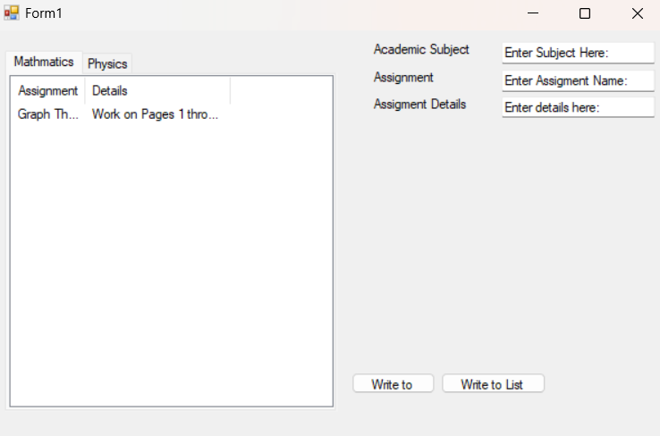

# Assignment Manager Solution

This is a prototype desktop application that allows users to have a Homework Assignment Agenda being able to have their assignments rendered, and entry fields to have better document their assignments. This application could result in better productivity from students.

# Update as of 20240824
## GUI Appearance

There are two buttons in the application one that writes to a CSV file that is stored locally on the User's client side, and then the Write to List button that renders the assignments on the List view on the side. Right now there are two main tabs Math and Physics each holding their own assignments.

## Acknowledgements

 - Professors at Kean University
 - Professors at NJIT
 - Research Mentors at Kean University
 - StackOverflow Q&A Discussion
 - ChatGPT
 - ClaudeAI

## Authors

- [@FPyC639](https://github.com/FPyC639)

## Appendix

